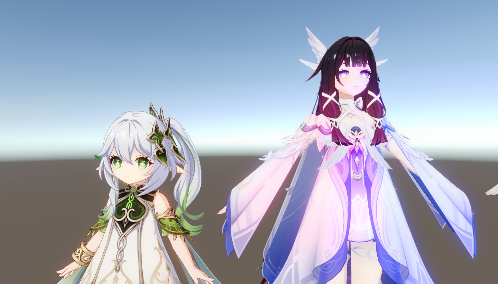
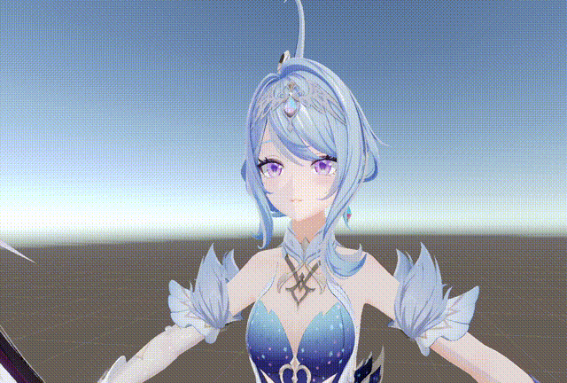
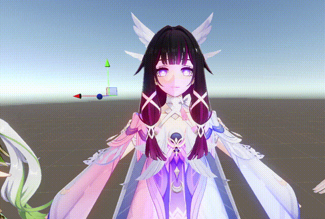

# NPRCharacter

A real-time anime character rendering showcase built with Unity URP. Explore toon shading, stylized face shadows, and multiple light sources with a free-flying camera.

## Run

On Windows 64-bit, extract the entire archive and launch **NPRCharacter.exe**. Keep the executable, `NPRCharacter_Data`, and the supplied runtime libraries together. No Unity Editor installation is required.

## Camera controls

Click the game window before using the controls. The camera has no collision; press **R** if you lose the characters.

| Input | Action |
| --- | --- |
| Hold right mouse button + drag | Look around |
| W / A / S / D | Move forward / left / backward / right |
| Q / E | Move down / up |
| Shift / Ctrl | Move faster / slower |
| Mouse wheel | Move forward / backward |
| Hold middle mouse button + drag | Pan |
| R | Restore the starting view |
| Esc | Release the mouse cursor |
| Alt + F4 | Quit |

## Rendering gallery

### Overview

### Face shadows

### Multiple light sources

